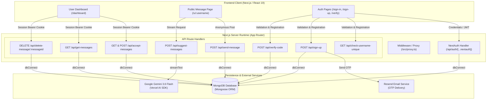
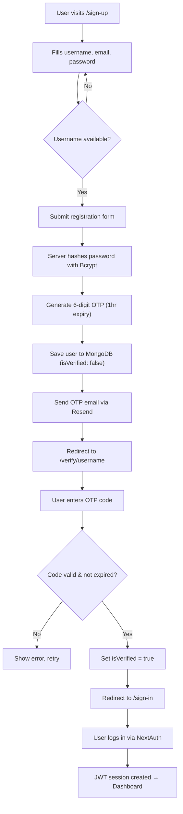
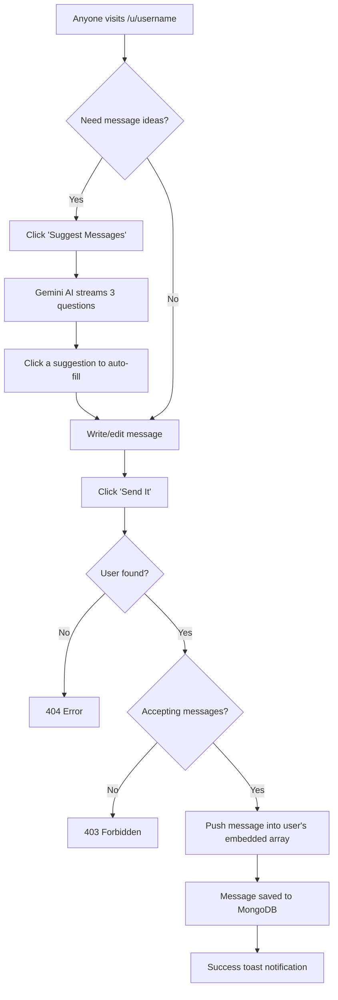
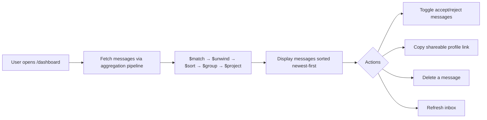

# RealTalk AI (True Feedback)

> **Next-generation, full-stack anonymous messaging platform powered by Next.js, MongoDB, NextAuth, Resend, and Google Gemini AI.**

---

## 📖 Table of Contents

- [Overview](#-overview)
- [Key Features](#-key-features)
- [System Architecture](#-system-architecture)
- [Application Flow](#-application-flow)
- [Tech Stack](#-tech-stack)
- [Data Models & Schema](#-data-models--schema)
- [API Reference](#-api-reference)
- [Project Directory Structure](#-project-directory-structure)
- [Getting Started](#-getting-started)
  - [Prerequisites](#prerequisites)
  - [Environment Variables](#environment-variables)
  - [Installation & Local Setup](#installation--local-setup)
- [Engineering Highlights & Deep Dives](#-engineering-highlights--deep-dives)

---

## 🌟 Overview

**RealTalk AI** (branded in-app as **True Feedback**) is an anonymous interaction platform inspired by services like NGL and Qooh.me. Registered users receive a personalized, public feedback link (`/u/[username]`). Anyone with this link can send feedback, constructive critique, or questions completely anonymously—no login or registration required.

### What makes RealTalk AI distinct:
- **AI-Powered Icebreakers:** Anonymous senders can generate engaging, safe icebreaker questions on the fly using **Google Gemini** streamed token-by-token via the **Vercel AI SDK**.
- **Real-Time Onboarding Safety:** Live debounced username validation, secure password hashing with Bcrypt, and 6-digit OTP verification delivered via **Resend** transactional email.
- **Embedded Document Architecture:** Leverages MongoDB embedded documents and custom multi-stage aggregation pipelines to deliver high-performance, chronologically sorted inboxes.
- **Granular Privacy Controls:** Users can toggle message intake on or off at any time directly from their dashboard.

---

## 🚀 Key Features

### 👤 Authentication & Onboarding
- **Live Debounced Username Check:** Automatically verifies username availability with a 300ms debounce as the user types.
- **Custom OTP Signup Lifecycle:** Decoupled registration engine that generates temporary 6-digit codes with 1-hour expiry windows.
- **Transactional React Email:** Sends branded HTML verification emails using `@react-email/components` and the Resend API.
- **NextAuth Session Management:** JWT session strategy with custom credentials authorization for username or email logins.

### 📬 User Dashboard (`/dashboard`)
- **Shareable Profile Link:** One-click copy for the user's public messaging link.
- **Accept Messages Toggle:** Instant live switch to pause or resume receiving anonymous messages.
- **Chronological Inbox:** Displays received messages sorted newest-first with formatted Day.js timestamps.
- **Interactive Deletion:** Message removal protected by Radix UI / Shadcn confirmation alert dialogs.
- **Manual Inbox Refresh:** One-click refresh with animated loading states.

### 🎭 Public Anonymous Messaging (`/u/[username]`)
- **Frictionless Submission:** Anyone can send anonymous messages without authentication.
- **Client & Server Validation:** Ensures messages are between 10 and 300 characters via Zod schemas.
- **AI Question Suggester:** Sends prompt requests to Google Gemini 3.6 Flash and streams three engaging question prompts.
- **Click-to-Insert:** Senders can click any suggested question to instantly populate the text area.

---

## 🏗️ System Architecture

The following diagram illustrates the end-to-end architecture of RealTalk AI across client interfaces, Next.js server runtime, database storage, and external third-party services.



## 🔄 Application Flow

### User Registration & Verification



### Anonymous Messaging & AI Suggestions



### Dashboard Message Flow



---

## 💻 Tech Stack

| Domain | Technology / Library | Purpose |
| :--- | :--- | :--- |
| **Framework** | [Next.js 16](https://nextjs.org/) (App Router) | React Server Components, nested routing, API routes |
| **Language** | [TypeScript 5](https://www.typescriptlang.org/) | End-to-end static typing and custom type augmentations |
| **Styling** | [Tailwind CSS v4](https://tailwindcss.com/) | Modern utility-first responsive styling |
| **UI Components** | [shadcn/ui](https://ui.shadcn.com/) / Radix UI | Accessible primitives (Dialog, Switch, Card, Form, Sonner) |
| **State & Forms** | [React Hook Form](https://react-hook-form.com/) + Zod | Schema-validated form state and error handling |
| **Database** | [MongoDB](https://www.mongodb.com/) & [Mongoose 9](https://mongoosejs.com/) | Document database with schema enforcement & aggregation |
| **Authentication** | [NextAuth.js v4](https://next-auth.js.org/) | Encrypted JWT cookie sessions & credentials provider |
| **Security** | [Bcrypt.js](https://github.com/dcodeIO/bcrypt.js) | Salting and hashing passwords (10 rounds) |
| **Email Service** | [Resend](https://resend.com/) & [React Email](https://react.email/) | Transactional OTP email generation and transmission |
| **Generative AI** | [Vercel AI SDK](https://sdk.vercel.ai/) & Google Gemini | Streaming open-ended prompt questions via `gemini-3.6-flash` |
| **HTTP Client** | [Axios](https://axios-http.com/) | Client-side HTTP requests with unified error parsing |
| **Utilities** | [Day.js](https://day.js.org/), Lucide React, usehooks-ts | Date formatting, icon set, and custom debouncing |

---

## 🗄️ Data Models & Schema

Messages are modeled as an embedded sub-document array within the primary `User` model, providing fast reads and atomicity.

### User Document (`src/models/User.ts`)

```typescript
export interface Message extends Document {
  content: string;
  createdAt: Date;
}

export interface User extends Document {
  username: string;
  email: string;
  password: string;
  verifyCode: string;
  verifyCodeExpiry: Date;
  isVerified: boolean;
  isAcceptingMessage: boolean;
  messages: Message[];
  createdAt: Date;
  updatedAt: Date;
}
```

### Mongoose Field Rules & Validation
- **`username`**: Unique, trimmed, required, regex validated (`/^[a-zA-Z0-9_]+$/`).
- **`email`**: Unique, required, regex validated for RFC email patterns.
- **`password`**: Stored as a one-way Bcrypt hash string.
- **`verifyCode` & `verifyCodeExpiry`**: 6-digit numeric string with a 1-hour expiry timestamp.
- **`isVerified`**: Boolean, defaults to `false`.
- **`isAcceptingMessage`**: Boolean, defaults to `true`.
- **`messages`**: Array of subdocuments adhering to `MessageSchema` (`content` string, `createdAt` timestamp).

---

## 🔌 API Reference

### 1. Authentication & Onboarding

| Method | Endpoint | Access | Description | Request Body / Params | Status Codes |
| :--- | :--- | :--- | :--- | :--- | :--- |
| `GET` | `/api/check-username-unique` | Public | Live debounced check for verified username collisions | `?username=string` | `200` Unique<br>`400` Taken / Invalid<br>`500` Error |
| `POST` | `/api/sign-up` | Public | Registers a new account and sends email verification OTP | `{ username, email, password }` | `201` Created<br>`400` Conflict<br>`500` Error |
| `POST` | `/api/verify-code` | Public | Verifies the 6-digit OTP and activates the account | `{ username, code }` | `200` Verified<br>`400` Expired/Invalid<br>`404` Not Found |
| `POST` | `/api/auth/[...nextauth]` | Public | Sign in via NextAuth credentials provider | `{ identifier, password }` | `200` Authenticated<br>`401` Unauthorized |

### 2. Message Management (Authenticated)

| Method | Endpoint | Access | Description | Request Body / Params | Status Codes |
| :--- | :--- | :--- | :--- | :--- | :--- |
| `GET` | `/api/accept-messages` | Protected | Retrieves current acceptance status of logged-in user | None | `200` Status retrieved<br>`401` Unauthorized |
| `POST` | `/api/accept-messages` | Protected | Updates the accept messages toggle (`true`/`false`) | `{ acceptMessage: boolean }` | `200` Updated<br>`401` Unauthorized |
| `GET` | `/api/get-messages` | Protected | Fetches all messages via MongoDB aggregation pipeline | None | `200` Messages returned<br>`401` Unauthorized<br>`404` Not found |
| `DELETE` | `/api/delete-message/[messageid]` | Protected | Removes a specific message using `$pull` | `messageid` URL route param | `200` Deleted<br>`401` Unauthorized<br>`404` Not found |

### 3. Public Sender & AI

| Method | Endpoint | Access | Description | Request Body / Params | Status Codes |
| :--- | :--- | :--- | :--- | :--- | :--- |
| `POST` | `/api/send-message` | Public | Sends an anonymous message to a recipient | `{ username, content }` | `200` Sent<br>`403` Intake Closed<br>`404` Not Found |
| `POST` | `/api/suggest-messages` | Public | Generates 3 icebreaker prompts via Gemini 3.6 Flash | None | `200` Text Stream (`||` separated) |

---

## 📁 Project Directory Structure

```text
realtalk-ai/
├── emails/
│   └── verificationEmail.tsx       # React-Email component for OTP email layout
├── public/                         # Static assets (SVGs, icons)
├── src/
│   ├── app/
│   │   ├── (app)/                  # Authenticated app routes group
│   │   │   ├── dashboard/
│   │   │   │   └── page.tsx        # Inbox management, message cards & link copy
│   │   │   ├── layout.tsx          # Shared dashboard layout with Navbar
│   │   │   └── page.tsx            # Landing / welcome hero page
│   │   ├── (auth)/                 # Unauthenticated authentication routes group
│   │   │   ├── sign-in/
│   │   │   │   └── page.tsx        # Login page (NextAuth credentials sign-in)
│   │   │   ├── sign-up/
│   │   │   │   └── page.tsx        # Registration page with debounced check
│   │   │   └── verify/[username]/
│   │   │       └── page.tsx        # 6-digit OTP verification screen
│   │   ├── api/                    # Next.js App Router API endpoints
│   │   │   ├── accept-messages/    # GET & POST message intake settings
│   │   │   ├── auth/[...nextauth]/ # NextAuth options & credential provider
│   │   │   ├── check-username-unique/ # Debounced username collision validator
│   │   │   ├── delete-message/[messageid]/ # Deletes message from embedded array
│   │   │   ├── get-messages/       # Aggregation pipeline message fetcher
│   │   │   ├── send-message/       # Public anonymous message poster
│   │   │   ├── sign-up/            # User creation & email dispatch handler
│   │   │   ├── suggest-messages/   # Google Gemini AI streaming endpoint
│   │   │   └── verify-code/        # OTP validation & account activation
│   │   ├── u/[username]/
│   │   │   └── page.tsx            # Public anonymous feedback submission page
│   │   ├── globals.css             # Tailwind base styles and theme definitions
│   │   └── layout.tsx              # Root HTML layout with AuthProvider & Toaster
│   ├── components/
│   │   ├── ui/                     # Reusable Shadcn UI primitives (button, card, dialog...)
│   │   ├── MessageCard.tsx         # Message card with timestamp and delete modal
│   │   └── Navbar.tsx              # Top navigation bar with session authentication state
│   ├── context/
│   │   └── AuthProvider.tsx        # NextAuth SessionProvider wrapper
│   ├── helpers/
│   │   └── sendVerificationEmail.ts # Resend API integration helper
│   ├── lib/
│   │   ├── dbConnect.ts            # Cached Mongoose database connection singleton
│   │   ├── resend.ts               # Resend client initialization
│   │   └── utils.ts                # Tailwind class merge utility (clsx + twMerge)
│   ├── models/
│   │   └── User.ts                 # User & Message Mongoose schema definitions
│   ├── schemas/                    # Zod validation schemas
│   │   ├── acceptMessageSchema.ts  # Boolean toggle validator
│   │   ├── messageSchema.ts        # Message content bounds (10-300 chars)
│   │   ├── signInSchema.ts         # Login credentials validator
│   │   ├── signUpSchema.ts         # Registration input & regex validator
│   │   └── verifySchema.ts         # 6-digit OTP validator
│   ├── types/
│   │   ├── ApiResponse.ts          # Standardized JSON response interface
│   │   └── next-auth.d.ts          # Extended NextAuth Session, User & JWT types
│   └── proxy.ts                    # Edge route protection & redirect handler
├── .env                            # Local environment configuration
├── components.json                 # Shadcn UI configuration
├── next.config.ts                  # Next.js build configuration
├── package.json                    # Project dependencies & scripts
└── tsconfig.json                   # TypeScript configuration
```

---

## 🛠️ Getting Started

### Prerequisites

Ensure you have the following installed:
- **Node.js** (v18.18.0 or newer recommended)
- **npm**, **pnpm**, or **yarn**
- **MongoDB Atlas account** (or local MongoDB instance)
- **Resend account** (for an API key)
- **Google AI Studio account** (for a Gemini API key)

---

### Environment Variables

Create a `.env` file in the root directory and configure the following variables:

```env
# MongoDB Connection String
MONGODB_URI=mongodb+srv://<username>:<password>@cluster0.mongodb.net/realtalk-ai?retryWrites=true&w=majority

# Resend API Key for Transactional Emails
RESEND_API_KEY=re_xxxxxxxxxxxxxxxxxxxx

# NextAuth Configuration
NEXTAUTH_SECRET=your_super_secret_jwt_key_here
NEXTAUTH_URL=http://localhost:3000

# Google Generative AI API Key (Gemini)
GOOGLE_GENERATIVE_AI_API_KEY=AIzaxxxxxxxxxxxxxxxxxxxxxxxxxxxx
```

---

### Installation & Local Setup

1. **Clone the Repository:**
   ```bash
   git clone https://github.com/your-username/realtalk-ai.git
   cd realtalk-ai
   ```

2. **Install Dependencies:**
   ```bash
   npm install
   ```

3. **Run the Development Server:**
   ```bash
   npm run dev
   ```

4. **Access the Application:**
   Open your browser and navigate to:
   - Web App: [http://localhost:3000](http://localhost:3000)
   - Sign Up: [http://localhost:3000/sign-up](http://localhost:3000/sign-up)
   - Dashboard: [http://localhost:3000/dashboard](http://localhost:3000/dashboard)

5. **Build for Production:**
   ```bash
   npm run build
   npm run start
   ```

---

## 🔬 Engineering Highlights & Deep Dives

### 1. Handling Next.js Hot-Reload in Mongoose
In a serverless or hot-reloading development environment (Next.js App Router), modules re-evaluate frequently. If you compile a Mongoose model repeatedly, it throws: `Cannot overwrite 'User' model once compiled`.
To prevent this, RealTalk AI uses a cached model definition:
```typescript
const UserModel = (mongoose.models.User as mongoose.Model<User>) || mongoose.model<User>("User", UserSchema);
export default UserModel;
```

### 2. Handling Empty Arrays in `$unwind`
By default, MongoDB's `$unwind` stage discards documents whose array is empty. For a brand new user with `messages: []`, unwinding without `preserveNullAndEmptyArrays` drops the entire document, causing the route to return an erroneous 404.
RealTalk AI explicitly sets:
```typescript
{ $unwind: { path: "$messages", preserveNullAndEmptyArrays: true } }
```
Followed by a `$filter` stage to strip out null subdocuments, returning a clean `messages: []`.

### 3. Non-Throwing Resend SDK Responses
The Resend Node.js SDK resolves its promise rather than throwing an exception when an API error occurs (e.g., domain verification issues or invalid keys). Code checking only `catch` blocks will silently miss failed dispatches:
```typescript
const { data, error } = await resend.emails.send(...);
if (error) {
  return { success: false, message: error.message };
}
```

---

## 📄 License

This project is licensed under the [MIT License](LICENSE).
